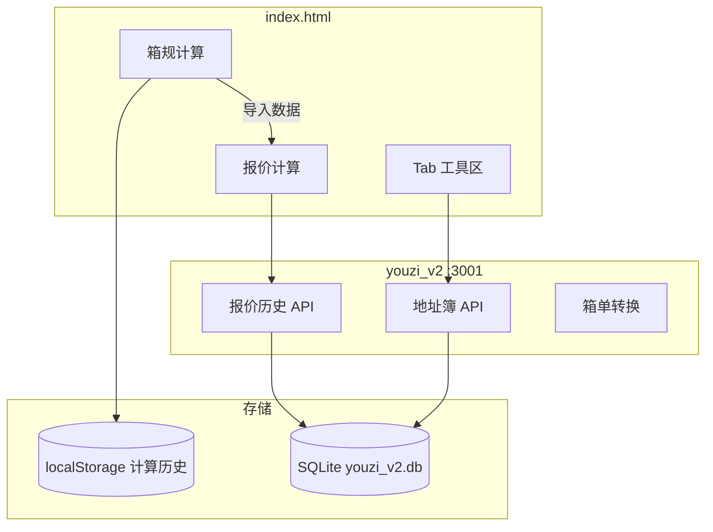

# 柚子不喝茶（youzi）功能文档

面向国际物流业务的内部工具集：前端以 `index.html` 为主工作台，配合 Python/Node 后端与若干运维脚本。本文档按模块整理当前仓库中的全部功能与使用方式。

---

## 目录

1. [项目概览](#项目概览)
2. [运行方式](#运行方式)
3. [主页面（index.html）](#主页面indexhtml)
4. [后台服务 youzi_v2](#后台服务-youzi_v2)
5. [本地服务 server（Node）](#本地服务-servernode)
6. [滞销运单报告（stales）](#滞销运单报告stales)
7. [Python 工具脚本](#python-工具脚本)
8. [数据与配置](#数据与配置)
9. [目录结构](#目录结构)

---

## 项目概览

| 组成部分 | 说明 |
|---------|------|
| **主前端** | `index.html` — 箱规计算、报价、成本、查价、地址簿等 |
| **youzi_v2** | FastAPI + SQLite — 报价历史、地址簿、箱单转换后台 |
| **server** | Express + SQLite — 可选的本地静态站与历史 API（与 v2 功能部分重叠） |
| **滞销报告** | `check_stale_shipments.py` 生成 `stales.html`（已 gitignore） |
| **渠道 API** | `channelAPI.py` — 多物流商轨迹批量查询 |

技术栈：Bootstrap 5、Decimal.js、SheetJS / ExcelJS、原生 JavaScript；后端 Python 3（FastAPI、openpyxl、xlrd）与 Node.js（Express、better-sqlite3）。

---

## 运行方式

### 方式一：仅打开前端（功能受限）

直接用浏览器打开 `index.html`（`file://`）。箱规计算、报价文本生成等本地逻辑可用；**报价历史写入、地址簿拉取**需启动 youzi_v2，否则会请求失败。

### 方式二：推荐 — youzi_v2 全功能

```bash
# 仓库根目录
pip install -r youzi_v2/requirements.txt
uvicorn youzi_v2.app:app --host 127.0.0.1 --port 3001 --reload
```

- 主工具页：打开 `index.html`（或自行用静态服务托管根目录）
- 后台管理：http://127.0.0.1:3001/
- 报价历史 API 默认：`http://127.0.0.1:3001`（页面可设 `window.YOUZI_V2_ORIGIN` 覆盖）

### 方式三：Node 本地服务（历史记录备选）

```bash
cd server
npm install
npm start
```

访问 http://localhost:3000 ，同源提供页面与 `quote-history` / `calculation-history` API。当前主流程已迁移至 youzi_v2 的报价历史；计算历史仍主要用 **localStorage**。

---

## 主页面（index.html）

页面标题：**柚子不喝茶**。自上而下分为三大块：**箱规计算**、**报价计算**、**Tab 工具区**。

### 1. 箱规计算

**用途**：录入多箱尺寸与重量，自动算体积、材积重、计费重、泡比，并做规则校验。

| 功能 | 说明 |
|------|------|
| 派送方式 | 卡派 / 海派 / 空派 / 快递5000（影响材积系数 6000 或 5000） |
| 国家与快递 | 美国、加拿大、欧洲、英国 + UPS/DPD/GLS/CWE |
| 箱规识别 | 单行文本解析：`长*宽*高`、重量、箱数；支持 `\|`、`== LCL Load Item` 等分隔 |
| Excel 粘贴 | 三列（箱数/重量/尺寸）或五列（箱数/重量/长/宽/高）；支持表头自动跳过 |
| 尺寸调整 | 一键对所有箱 +1 / +2 / +3 cm |
| 箱数补全 | 将所有行箱数设为 1 |
| 箱规表格 | 多行增删复制；实时算体积、单箱材积、周长等 |
| 规则警告 | 按 `data/data.js` 中 `boxRules` 校验超长、超重等，徽章显示条数 |
| 导入数据 | 将总箱数/实重/体积写入下方「单地址报价」 |
| 计算历史 | localStorage，最多约 50 条，可恢复、清空 |
| 汇总信息 | 计费重、箱规描述等折叠展示 |

**材积与计费**：使用 Decimal.js；单箱材积按派送方式选除数；计费重取实重与材积重较大值（具体逻辑见 `js/logistics.js` 的 `calculate()`）。

---

### 2. 报价计算

分 **单地址报价** 与 **批量报价** 两个 Tab。

#### 2.1 单地址报价

| 功能 | 说明 |
|------|------|
| 报价识别 | 解析 `21ctns 8.3kg 2.126cbm` 或 `45*45*50 10kg 21箱` 等格式 |
| 运输信息 | 运输方式（随国家变化）、国家、发货地（华东/华南）、客户代码、品名 |
| 核心字段 | 地址、邮编、箱数、实重、体积、计费重、计费方、泡比、成本、利润、利率、单价、综合单价 |
| 附加选项 | 偏远、住宅、带电、超尺寸/超重（可填单价与箱数）、MOQ、MOQ Box、提货费、DDU/DDP、美元报价、承运商、分泡 30%/50% |
| 报价格式 | 通用、通用-CBM、通用-单价、通用-RMB、PROBOXX、161、163 等（控制 `notes` 文本模板） |
| 特别提示 | 根据渠道/国家动态 Badge |
| 特别说明 | 可点击标签拼入报价文本 |
| 报价文本 | 自动生成中英文风格备注；复制（Ctrl+C）可触发保存历史 |
| 报价历史 | 模态框：搜索、按国家/日期筛选、分页；数据来自 **youzi_v2** `/api/quote-history` |

**联动逻辑**（`js/logistics.js`、`js/ui.js`、`js/rules.js`）：

- 邮编 → 分区（美东/美中/美西等）→ 快递派查价
- 地址库匹配 → 自动填邮编、偏远/住宅
- 成本、利润、汇率（约 6.8 / 7.1）→ RMB/USD 报价与综合单价
- 切换部分运输方式时自动切到「快递派查价」Tab

#### 2.2 批量报价

| 功能 | 说明 |
|------|------|
| 箱规信息 | 如 `45*45*50 10KG 50CTNS` |
| 地址分配 | 如 `RDU4 4CTNS \| AVP1 25CTNS` |
| 品名 / 利润 / 提货费 | 批量参数 |
| 渠道多选 | Sea truck、Fast sea truck、Sea express、Fast sea express、Air express 等 |
| 发货区域 | Sea/Air express 类渠道需选华东/华南 |
| 生成报价 | 按地址×渠道生成折叠表格，可改成本/利润 |
| 导出 | 按地址、按渠道、或导出 Excel |
| 快速添加 | 常用地址组合快捷录入 |

---

### 3. Tab 工具区

#### 3.1 快速查询

| 入口 | 功能 |
|------|------|
| **常用术语** | 分类/标签筛选、列表与网格视图、搜索；数据来自 `data/data.js` |
| **客户地址簿** | 从 youzi_v2 `/api/addresses` 加载；搜索、商业/住宅、偏远筛选；复制、导出 |
| **世界时钟** | 多时时区实时显示（含与北京时差） |
| **物流备忘录** | 国家信息、术语、FAQ；列表/网格；可导出 |
| **常用网址** | 分类书签（快递、海关、汇率等）；搜索与网格/列表 |
| **派送时间查询** | 批量 FBA 地址 + 渠道 + ETD → 预计派送日；可复制英文表格 |
| **仓库查询** | 仓库码表检索、筛选、多选复制、导出 Excel（`warehouse_data.js`） |

#### 3.2 快捷回复

按分类浏览中英文话术；搜索下拉；一键复制中文或英文内容。数据：`data/data.js` 中的 `quickReplies`。

#### 3.3 成本计算

| 模块 | 说明 |
|------|------|
| 报价识别 | 同主报价，解析箱数/重量/体积 |
| 产品选择 | 品名 + 海关编码（HS Code） |
| 重量比 | 363 / 360 / 400 / 450 / 500 / 实际方 |
| **自税（DDU）** | 按方表价、按方包税、货值、税率（含美国基础关税 20% 提示）、派送费、头程、税金、总成本、单价 |
| **包税（DDP）** | 多行对比；按 kg 表价；支持增删复制行 |

#### 3.4 快递派查价

- 华南 / 华东两张分区价格表（12KG、21KG+、45KG+…）
- 选择发货区域、渠道（美森正班/加班、普船、以星合德、空派等）
- 根据报价页邮编与计费重显示参考单价（`tab.js` → `calculatePrice`）

#### 3.5 车型查询（提货费）

- 起始地、收货地、货物类型、重量、方数
- 按规则推荐车型并显示提货费（RMB）
- 车型参数表：厢长、载重、载方（`data/data.js` → `vehicleTypes`）

#### 3.6 柚子杂货铺

- **日期计算工具**：日期 ± 天数、两日期间隔、快捷设今天/明天/昨天

---

## 后台服务 youzi_v2

访问：http://127.0.0.1:3001/

| 菜单 | 功能 |
|------|------|
| **仪表盘** | 报价条数、地址条数、健康检查；**计费重差率**计算器（客户 vs 实际，超 ±3% 标红） |
| **报价历史** | 全字段 CRUD、清空；与 index 页字段对齐（客户、品名、国家、地址、渠道、费用等） |
| **常用地址** | 增删改查，供 index 地址簿调用 |
| **箱单转换** | 上传箱单发票（xlsx/xls）→ 生成「产品导入模版.xls」下载 |

### API 摘要

| 方法 | 路径 | 说明 |
|------|------|------|
| GET | `/api/health` | 服务状态 |
| GET/POST | `/api/quote-history` | 列表 / 后台简易新增 |
| POST | `/api/quote-history/index` | index 页完整快照写入 |
| PUT/DELETE | `/api/quote-history/{id}` | 更新 / 删除 |
| DELETE | `/api/quote-history` | 清空 |
| GET/POST | `/api/addresses` | 地址簿列表 / 新增 |
| PUT/DELETE | `/api/addresses/{id}` | 更新 / 删除 |
| POST | `/api/product-import` | 上传发票转换 |
| GET | `/api/product-import/download/{task_id}` | 下载生成文件 |

数据文件：`youzi_v2/data/youzi_v2.db`（SQLite，已 gitignore）。临时上传/输出：`youzi_v2/temp/`。

箱单转换脚本：`tools/product_import/generate_product_import.py`，字段映射：`tools/product_import/field_mapping.json`，模板：`tools/product_import/samples/*.xls`。

---

## 本地服务 server（Node）

| API | 说明 |
|-----|------|
| `GET/POST /api/quote-history` | 报价历史（最多 100 条） |
| `DELETE /api/quote-history/:id` | 删除单条 |
| `GET/POST /api/calculation-history` | 箱规计算历史（最多 50 条） |

静态托管仓库根目录，端口默认 **3000**。若 SQLite 初始化失败会降级为内存存储。

---

## 滞销运单报告（stales）

**生成**（需配置 `config/config.json` 与 `data/tracking_numbers.json`）：

```bash
python check_stale_shipments.py
```

输出 **`stales.html`**（仓库根目录，已在 `.gitignore`）。

| 功能 | 说明 |
|------|------|
| 轨迹拉取 | 调用配置的物流 API，标注停滞天数 |
| 查验状态 | 结合 `data/inspection.json`，国内/国外查验天数与颜色 |
| 筛选 | 渠道、承运商、客户、国家、仓库、ETA 3 天内、问题件等 |
| 热力图 | 按客户/国家统计停滞与查验（`js/stales/heatmap.js`） |
| 分页 | 每页条数存 localStorage（`staleShipmentsPageSize`） |
| 导出 | 最新轨迹导出 Excel（`js/stales/stales.js`） |

前端脚本：`js/stales/stales.js`、`css/stales.css`。

---

## Python 工具脚本

| 脚本 | 用途 |
|------|------|
| `channelAPI.py` | 多 vendor 配置，并发查询运单轨迹（供滞销脚本等调用） |
| `check_stale_shipments.py` | 滞销分析 + 生成 HTML 报告 |
| `tools/product_import/generate_product_import.py` | 箱单发票 → 产品导入 Excel |
| `parse_warehouse.py` | 从 Excel（如 AD.xlsx）生成 `warehouse_data.js` |
| `remove_tracking.py` | 按 `data/remove_tracking.txt` 从 assignments 等 JSON 移除运单 |
| `rename_utils.py` | 按 `rename.data` 规则批量重命名跟踪号相关文件 |
| `work.py` | 独立桌面小工具：工作时段工资/工时计算（Tkinter，与物流主流程无关） |

---

## 数据与配置

### 前端数据（`data/`）

| 文件 | 内容 |
|------|------|
| `data.js` | 渠道列表、车型、箱规规则 `boxRules`、派送方式映射、快捷回复、术语等 |
| `data_basic.js` | 基础常量 |
| `data_price.js` | 快递派分区价格 |
| `data_logistics.js` | 物流备忘录内容 |
| `data_bookmarks.js` | 常用网址 |
| `warehouse_data.js` | FBA/仓库码表 |
| `private_data.js` | 私有数据（若存在，需本地维护，可能未入库） |
| `inspection.json` | 查验中的运单 |
| `tracking_numbers.json` | 待查询运单列表（脚本用） |

### 配置

| 路径 | 说明 |
|------|------|
| `config/style.js` | 前端样式相关配置 |
| `config/config.json` | 物流 API、vendor、渠道过滤（脚本用，敏感信息勿提交） |
| `rename.data` | 运单号文件重命名规则 |

### 样式与静态资源

- `css/youzi.css`、`css/stales.css`
- `css/common/bootswatch/` Bootstrap 主题
- `js/common/`：Bootstrap、Decimal、xlsx、exceljs 等

---

## 目录结构

```
youzi/
├── index.html              # 主工作台
├── DOCS.md                 # 本文档
├── data/                   # 前端数据与脚本用 JSON
├── config/                 # 样式与 API 配置
├── css/ / js/              # 样式与业务脚本
│   ├── logistics.js        # 箱规、报价、批量报价、历史
│   ├── common.js           # 计算历史、派送时间、工具函数
│   ├── tab.js              # Tab：术语、成本、查价、地址簿、时钟等
│   ├── ui.js / rules.js / caltools.js / bookmarks.js / warehouse.js
│   └── stales/             # 滞销报告页脚本
├── server/                 # Node 本地服务
├── youzi_v2/               # FastAPI 后台
│   ├── app.py
│   ├── db/                 # SQLite 表定义
│   ├── templates/          # admin.html
│   └── static/             # 后台 CSS/JS
├── tools/product_import/   # 箱单转换
├── check_stale_shipments.py
├── channelAPI.py
└── …                       # 其他运维脚本
```

---

## 功能依赖关系简图



---

## 维护说明

1. **价格与渠道**：主要改 `data/data_price.js`、`data/data.js` 中的渠道与 `boxRules`。
2. **报价历史**：以 youzi_v2 为准；确保 index 页与后端同时运行，或配置正确的 `YOUZI_V2_ORIGIN`。
3. **地址簿**：在后台 http://127.0.0.1:3001/ 维护，index 打开地址簿时自动拉取。
4. **滞销报告**：`stales.html` 为生成物，勿手改；改逻辑请编辑 `check_stale_shipments.py` 与 `js/stales/*`。
5. **敏感文件**：`config/config.json`、`data/private_data.js`、数据库等勿提交公开仓库。

---

*文档根据仓库当前代码整理，如有新增模块请同步更新本节。*
