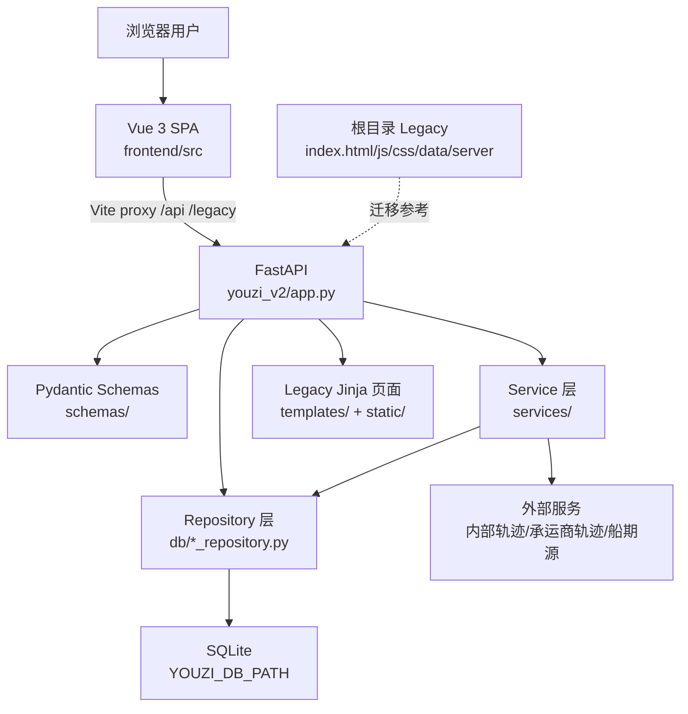
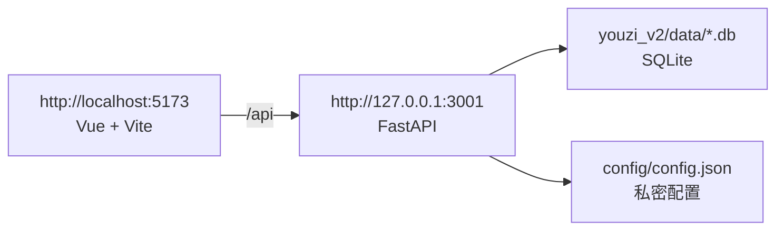
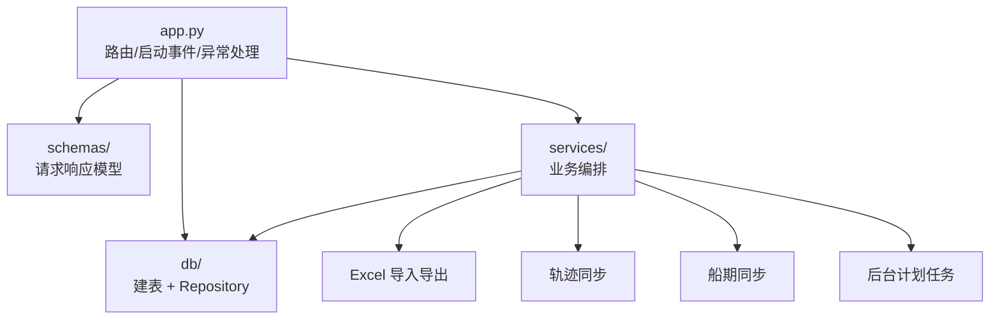
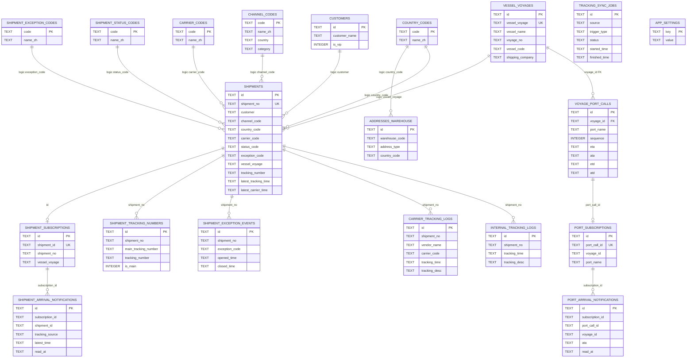
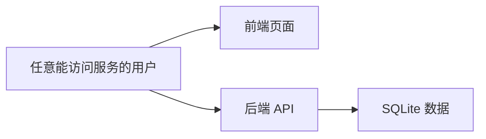
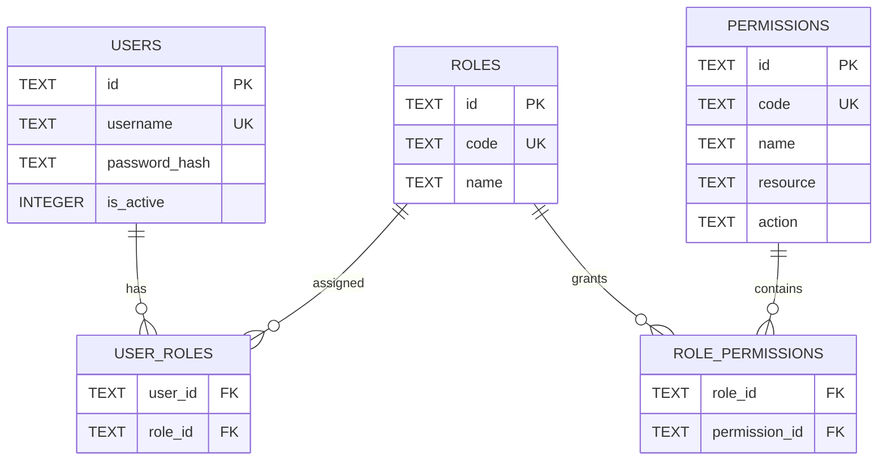

# Youzi 项目总览

本文档基于当前仓库代码整理，重点分析 `youzi_v2/`。根目录 Legacy 静态页、脚本和 `server/` 视为历史系统与迁移来源；后续若只保留 `youzi_v2/`，可优先保留本文标注的主线模块、数据库表与 API。

## 1. 项目架构图

### 1.1 当前架构

### 1.2 运行时端口

### 1.3 后端分层

## 2. 所有模块说明

### 2.1 根目录模块

| 路径 | 类型 | 说明 | 迁移建议 |
| --- | --- | --- | --- |
| `youzi_v2/` | 主线应用 | 当前 Vue + FastAPI + SQLite 应用 | 保留 |
| `config/` | 本地配置 | `config.json` 放置目录，保存 Token、Cookie、承运商配置 | 保留，但不提交私密文件 |
| `index.html`、`css/`、`js/`、`data/` | Legacy 前端 | 旧版单页工具集合 | 逐步迁移到 `youzi_v2/frontend` |
| `server/` | Legacy Node 服务 | Express 旧服务 | 迁移完成后可删除 |
| `tools/` | 辅助工具 | 商品导入等转换脚本和模板 | 按功能迁入 `youzi_v2/services` 或保留工具目录 |
| `report.html`、`stales.html` | Legacy 页面 | 报表、旧运单/滞留页面 | 迁移完成后可删除 |
| `channelAPI.py`、`work.py`、`check_stale_shipments.py` | 历史脚本 | 旧数据处理/接口脚本 | 梳理业务逻辑后迁入 service/script |

### 2.2 `youzi_v2/` 顶层

| 路径 | 说明 |
| --- | --- |
| `app.py` | FastAPI 主入口；集中定义 API、Legacy 页面、启动/关闭事件和后台同步启动 |
| `frontend/` | Vue 3 + Vite + TypeScript 前端 |
| `db/` | SQLite 连接、建表迁移、Repository、统计查询和订阅通知存储 |
| `services/` | 轨迹、承运商、船期、Excel、计划任务、世界时间等业务服务 |
| `schemas/` | Pydantic 请求/响应模型 |
| `docs/` | 已有架构、部署、数据库、API 和模块文档 |
| `tests/` | pytest 测试，覆盖轨迹、船期、导入、Repository 等 |
| `scripts/` | 命令行任务，如定时同步轨迹 |
| `templates/`、`static/` | 后端渲染的 Legacy/工具页面 |
| `config/` | Excel 字段映射等非私密配置 |
| `data/` | SQLite 数据库，本地运行产物 |
| `logs/` | 同步日志，本地运行产物 |

### 2.3 前端模块

| 模块 | 路径 | 说明 |
| --- | --- | --- |
| 应用入口 | `frontend/src/main.ts`、`App.vue` | 挂载 Vue 应用 |
| 路由 | `frontend/src/router/index.ts` | 定义主页面路由 |
| 布局 | `frontend/src/layouts/AppLayout.vue` | 侧栏、顶栏、内容区 |
| 导航 | `frontend/src/constants/navigation.ts` | 侧栏分组和菜单 |
| API 封装 | `frontend/src/api/*.ts` | 前端访问后端的唯一封装层 |
| 类型 | `frontend/src/types/*.ts` | 前端业务类型 |
| 通用组件 | `frontend/src/components/common/` | 图标按钮、徽标等 |
| 首页组件 | `frontend/src/components/home/` | 海运预警、首页卡片 |
| 运单组件 | `frontend/src/components/shipments/` | 表单、轨迹抽屉、异常弹窗、批量编辑 |
| 船期组件 | `frontend/src/components/vessel-schedules/` | 航次表单、船名搜索、挂靠时间线 |
| 组合函数 | `frontend/src/composables/` | 主题、世界时间、字典标签、侧栏状态 |
| 工具函数 | `frontend/src/utils/` | 格式化、复制、轨迹新鲜度、港口展示等 |

### 2.4 后端 `db/` 模块

| 模块 | 说明 |
| --- | --- |
| `connection.py` | SQLite 连接、路径解析、线程锁、初始化入口 |
| `*_table.py` | 表结构创建、兼容迁移、索引初始化 |
| `*_repository.py` | 面向 API/service 的数据访问层 |
| `shipments_*` | 运单主表、查询、批量更新、订阅、异常、统计 |
| `vessel_*` | 航次、挂靠港、船期查询和更新 |
| `tracking_*` | 轨迹日志、同步任务记录、新鲜度计算 |
| `code_tables*`、`dict_*` | 码表和字典 |
| `addresses_*` | 地址簿和仓库地址 |
| `customers_*`、`channels_*` | 客户和渠道 |
| `quote_history_table.py` | Legacy 报价历史兼容 |

### 2.5 后端 `services/` 模块

| 模块 | 说明 |
| --- | --- |
| `tracking_sync.py` | 内部轨迹同步，写入内部轨迹日志并更新运单摘要 |
| `carrier_tracking_sync.py` | 承运商轨迹同步，写入承运商轨迹日志 |
| `carrier_vendors.py` | 承运商适配器和配置读取 |
| `tracking_sync_scheduler.py` | Uvicorn 启动后的后台定时同步 |
| `internal_batch_schedule.py`、`carrier_batch_schedule.py` | 手动/批量同步任务编排 |
| `scheduled_sync_settings.py`、`scheduled_tasks_info.py` | 计划任务配置、概览、运行状态 |
| `shipment_excel.py` | 运单 Excel 导入导出 |
| `vessel_schedule_excel.py` | 船期 Excel 模板、导入 |
| `vessel_schedule_sync.py` | 外部船期预览/同步 |
| `maritime_alerts.py` | 首页海运预警与到港通知聚合 |
| `address_excel.py` | 仓库地址 Excel 导入导出 |
| `code_table_excel.py` | 码表 Excel 导入和模板 |
| `logistics_tracking.py` | 内部物流轨迹接口访问 |
| `port_code_resolve.py` | 港口代码解析 |
| `voyage_status.py` | 航次/挂靠状态计算 |
| `world_clocks_settings.py` | 世界时间设置读写和校验 |

### 2.6 后端 `schemas/` 模块

| 模块 | 说明 |
| --- | --- |
| `shipments.py` | 运单 CRUD、批量操作、导入导出相关模型 |
| `tracking.py`、`tracking_freshness.py` | 轨迹同步、轨迹新鲜度模型 |
| `shipment_exceptions.py` | 运单异常开启/关闭/历史模型 |
| `vessel_schedules.py` | 航次、挂靠港、船期导入同步模型 |
| `maritime_alerts.py` | 海运预警和通知模型 |
| `customers.py`、`channels.py` | 客户、渠道模型 |
| `code_tables.py` | 码表模型 |
| `statistics.py` | 统计概览模型 |
| `scheduled_tasks.py` | 计划任务配置、任务历史模型 |
| `world_clocks.py` | 世界时间设置模型 |

## 3. 所有 API 说明

Base URL：`http://127.0.0.1:3001`

新接口主要使用 `/api/v1/`；兼容 Legacy 的接口仍使用 `/api/`。当前代码未实现登录鉴权，所有接口在服务可访问范围内开放。

### 3.1 页面与健康检查

| 方法 | 路径 | 处理函数 | 说明 |
| --- | --- | --- | --- |
| GET | `/` | `index` | 后端渲染首页/Legacy 入口 |
| GET | `/tools/product-import` | `product_import_page` | 商品导入工具页面 |
| GET | `/api/health` | `health` | Legacy 健康检查 |
| GET | `/api/v1/health` | `health_v1` | v2 健康检查 |

### 3.2 字典与码表

| 方法 | 路径 | 处理函数 | 说明 |
| --- | --- | --- | --- |
| GET | `/api/v1/dict/{dict_type}` | `list_dict_entries` | 查询字典项 |
| GET | `/api/v1/admin/code-tables` | `list_code_table_types` | 码表类型列表 |
| GET | `/api/v1/admin/code-tables/{table_name}` | `list_code_table_rows` | 码表行列表，支持搜索、分页 |
| GET | `/api/v1/admin/code-tables/{table_name}/template` | `download_code_table_template` | 下载码表 Excel 模板 |
| GET | `/api/v1/admin/code-tables/{table_name}/{code}` | `get_code_table_row` | 获取码表单行 |
| POST | `/api/v1/admin/code-tables/{table_name}` | `create_code_table_row` | 新增码表行 |
| PUT | `/api/v1/admin/code-tables/{table_name}/{code}` | `update_code_table_row` | 更新码表行 |
| DELETE | `/api/v1/admin/code-tables/{table_name}/{code}` | `delete_code_table_row` | 删除码表行 |
| POST | `/api/v1/admin/code-tables/{table_name}/import` | `import_code_table_excel` | 导入码表 Excel |

### 3.3 运单

| 方法 | 路径 | 处理函数 | 说明 |
| --- | --- | --- | --- |
| GET | `/api/v1/shipments` | `list_shipments` | 运单列表，支持搜索、状态、异常、客户、渠道、国家、船名航次、轨迹新鲜度等筛选 |
| GET | `/api/v1/shipments/filter-options` | `list_shipment_filter_options` | 运单筛选项 |
| GET | `/api/v1/shipments/tracking-freshness-stats` | `get_shipment_tracking_freshness_stats` | 轨迹新鲜度统计 |
| GET | `/api/v1/shipments/export` | `export_shipments_excel` | 导出运单 Excel |
| GET | `/api/v1/shipments/{item_id}` | `get_shipment` | 运单详情 |
| POST | `/api/v1/shipments` | `create_shipment` | 新建运单 |
| PUT | `/api/v1/shipments/{item_id}` | `update_shipment` | 更新运单 |
| DELETE | `/api/v1/shipments/{item_id}` | `delete_shipment` | 删除运单 |
| POST | `/api/v1/shipments/batch-delete` | `batch_delete_shipments` | 批量删除 |
| PATCH | `/api/v1/shipments/batch-update` | `batch_update_shipments` | 批量更新 |
| POST | `/api/v1/shipments/import` | `import_shipments_excel` | 导入运单 Excel |
| POST | `/api/v1/shipments/sync-tracking` | `sync_shipments_internal_tracking` | 手动同步内部轨迹 |
| POST | `/api/v1/shipments/sync-carrier-tracking` | `sync_shipments_carrier_tracking` | 手动同步承运商轨迹 |
| GET | `/api/v1/shipments/tracking-sync/daily-stats` | `get_tracking_sync_daily_stats` | 同步日统计 |
| GET | `/api/v1/shipments/{item_id}/tracking-logs` | `list_shipment_internal_tracking_logs` | 内部轨迹日志 |
| GET | `/api/v1/shipments/{item_id}/carrier-tracking-logs` | `list_shipment_carrier_tracking_logs` | 承运商轨迹日志 |
| POST | `/api/v1/shipments/exceptions/open` | `open_shipment_exceptions` | 批量开启异常 |
| POST | `/api/v1/shipments/exceptions/close` | `close_shipment_exceptions` | 批量关闭异常 |
| GET | `/api/v1/shipments/{item_id}/exception-events` | `list_shipment_exception_events` | 异常历史 |
| POST | `/api/v1/shipments/{item_id}/subscribe` | `subscribe_shipment` | 订阅运单轨迹更新 |
| DELETE | `/api/v1/shipments/{item_id}/subscribe` | `unsubscribe_shipment` | 取消运单订阅 |
| POST | `/api/v1/shipments/batch-subscribe` | `batch_subscribe_shipments` | 批量订阅 |
| POST | `/api/v1/shipments/batch-unsubscribe` | `batch_unsubscribe_shipments` | 批量取消订阅 |

### 3.4 运单订阅通知

| 方法 | 路径 | 处理函数 | 说明 |
| --- | --- | --- | --- |
| GET | `/api/v1/shipment-subscriptions/notifications` | `list_shipment_subscription_notifications` | 顶栏未读运单通知 |
| POST | `/api/v1/shipment-subscriptions/notifications/read-all` | `mark_all_shipment_subscription_notifications_read` | 运单通知全部已读 |

### 3.5 船期

| 方法 | 路径 | 处理函数 | 说明 |
| --- | --- | --- | --- |
| GET | `/api/v1/vessel-schedules` | `list_vessel_schedules` | 航次列表 |
| GET | `/api/v1/vessel-schedules/template` | `download_vessel_schedule_template` | 下载船期导入模板 |
| GET | `/api/v1/vessel-schedules/providers` | `list_vessel_schedule_providers` | 外部船期数据源 |
| GET | `/api/v1/vessel-schedules/vessels/search` | `search_carrier_vessel_names` | 按船司搜索船名 |
| GET | `/api/v1/vessel-schedules/fetch/preview` | `preview_external_vessel_schedule` | 预览外部船期 |
| POST | `/api/v1/vessel-schedules/fetch/sync` | `sync_external_vessel_schedule` | 同步单个外部船期 |
| POST | `/api/v1/vessel-schedules/fetch/sync-all` | `sync_all_external_vessel_schedules` | 批量同步外部船期 |
| GET | `/api/v1/vessel-schedules/{voyage_id}` | `get_vessel_schedule` | 航次详情，含挂靠 |
| GET | `/api/v1/vessel-schedules/{voyage_id}/shipments` | `list_vessel_schedule_shipments` | 查询关联运单 |
| POST | `/api/v1/vessel-schedules` | `create_vessel_schedule` | 新建航次 |
| PATCH | `/api/v1/vessel-schedules/{voyage_id}` | `update_vessel_schedule` | 更新航次 |
| DELETE | `/api/v1/vessel-schedules/{voyage_id}` | `delete_vessel_schedule` | 删除航次 |
| POST | `/api/v1/vessel-schedules/import` | `import_vessel_schedules_excel` | 导入船期 Excel |
| POST | `/api/v1/vessel-schedules/port-calls/{port_call_id}/subscribe` | `subscribe_port_call` | 订阅挂靠港到港提醒 |
| DELETE | `/api/v1/vessel-schedules/port-calls/{port_call_id}/subscribe` | `unsubscribe_port_call` | 取消挂靠港订阅 |

### 3.6 海运预警

| 方法 | 路径 | 处理函数 | 说明 |
| --- | --- | --- | --- |
| GET | `/api/v1/maritime-alerts/overview` | `get_maritime_alerts_overview` | 首页海运预警概览 |
| POST | `/api/v1/maritime-alerts/port-arrivals/{notification_id}/read` | `mark_port_arrival_notification_read` | 单条港口到港通知已读 |
| POST | `/api/v1/maritime-alerts/shipment-arrivals/{notification_id}/read` | `mark_shipment_arrival_notification_read` | 单条运单通知已读 |
| POST | `/api/v1/maritime-alerts/notifications/read-all` | `mark_all_maritime_notifications_read` | 海运预警全部已读 |

### 3.7 客户

| 方法 | 路径 | 处理函数 | 说明 |
| --- | --- | --- | --- |
| GET | `/api/v1/customers` | `list_customers` | 客户列表，支持搜索、VIP 筛选、分页 |
| POST | `/api/v1/customers/sync-from-shipments` | `sync_customers_from_shipments` | 从运单同步客户 |
| POST | `/api/v1/customers` | `create_customer` | 新增客户 |
| PATCH | `/api/v1/customers/{item_id}` | `update_customer` | 更新客户 |
| DELETE | `/api/v1/customers/{item_id}` | `delete_customer` | 删除客户 |

### 3.8 渠道

| 方法 | 路径 | 处理函数 | 说明 |
| --- | --- | --- | --- |
| GET | `/api/v1/channels/meta` | `get_channels_meta` | 渠道分类等元数据 |
| GET | `/api/v1/channels` | `list_channels` | 渠道列表，支持搜索、国家、分类、启用状态 |
| POST | `/api/v1/channels/seed-defaults` | `seed_default_channels` | 写入默认渠道 |
| POST | `/api/v1/channels` | `create_channel` | 新增渠道 |
| PATCH | `/api/v1/channels/{code}` | `update_channel` | 更新渠道 |
| DELETE | `/api/v1/channels/{code}` | `delete_channel` | 删除渠道 |

### 3.9 统计、设置、计划任务

| 方法 | 路径 | 处理函数 | 说明 |
| --- | --- | --- | --- |
| GET | `/api/v1/statistics/shipments/overview` | `get_shipment_statistics_overview` | 运单统计概览 |
| GET | `/api/v1/settings/world-clocks` | `get_world_clocks_settings_api` | 获取世界时间设置 |
| PUT | `/api/v1/settings/world-clocks` | `update_world_clocks_settings_api` | 更新世界时间设置 |
| GET | `/api/v1/scheduled-tasks/overview` | `get_scheduled_tasks_overview` | 计划任务概览 |
| PUT | `/api/v1/scheduled-tasks/settings` | `update_scheduled_tasks_settings` | 更新计划任务设置 |
| GET | `/api/v1/scheduled-tasks/jobs` | `list_scheduled_task_jobs` | 同步任务历史 |
| POST | `/api/v1/scheduled-tasks/run-internal-sync` | `run_scheduled_tasks_internal_sync` | 手动运行内部轨迹同步 |
| POST | `/api/v1/scheduled-tasks/run-carrier-sync` | `run_scheduled_tasks_carrier_sync` | 手动运行承运商轨迹同步 |
| POST | `/api/v1/scheduled-tasks/run-tracking-sync` | `run_scheduled_tasks_tracking_sync` | 手动运行组合轨迹同步 |

### 3.10 地址簿

| 方法 | 路径 | 处理函数 | 说明 |
| --- | --- | --- | --- |
| GET | `/api/addresses` | `get_addresses` | Legacy 派送地址列表 |
| POST | `/api/addresses` | `create_address` | Legacy 新增派送地址 |
| PUT | `/api/addresses/{item_id}` | `update_address` | Legacy 更新派送地址 |
| DELETE | `/api/addresses/{item_id}` | `delete_address` | Legacy 删除派送地址 |
| GET | `/api/addresses-warehouse/filter-options` | `get_warehouse_address_filter_options` | 仓库地址筛选项 |
| GET | `/api/addresses-warehouse` | `get_warehouse_addresses` | 仓库地址列表 |
| POST | `/api/addresses-warehouse` | `create_warehouse_address` | 新增仓库地址 |
| PUT | `/api/addresses-warehouse/{item_id}` | `update_warehouse_address` | 更新仓库地址 |
| DELETE | `/api/addresses-warehouse/{item_id}` | `delete_warehouse_address` | 删除仓库地址 |
| GET | `/api/addresses-warehouse/template` | `download_warehouse_address_template` | 下载仓库地址模板 |
| GET | `/api/addresses-warehouse/export` | `export_warehouse_addresses_excel` | 导出仓库地址 |
| POST | `/api/addresses-warehouse/import` | `import_warehouse_addresses_excel` | 导入仓库地址 |

### 3.11 Legacy 报价与商品导入

| 方法 | 路径 | 处理函数 | 说明 |
| --- | --- | --- | --- |
| GET | `/api/quote-history` | `get_quote_history` | 报价历史列表 |
| POST | `/api/quote-history` | `create_quote_history` | 新增报价历史 |
| POST | `/api/quote-history/index` | `create_quote_from_index_page` | 旧首页写入报价历史 |
| PUT | `/api/quote-history/{item_id}` | `update_quote_history` | 更新报价历史 |
| DELETE | `/api/quote-history/{item_id}` | `delete_quote_history` | 删除单条报价历史 |
| DELETE | `/api/quote-history` | `clear_quote_history` | 清空报价历史 |
| POST | `/api/product-import` | `product_import` | 上传箱单/发票并生成商品导入结果 |
| GET | `/api/product-import/download/{task_id}` | `download_file` | 下载商品导入结果 |

## 4. 数据库 ER 图

当前 SQLite 只有少量强外键，多数关系通过业务字段逻辑关联。图中关系标签带 `FK` 的是数据库强外键，带 `logic` 的是业务逻辑关联。

### 4.1 表清单

| 表 | 作用 | 保留建议 |
| --- | --- | --- |
| `shipments` | 运单主表 | 核心保留 |
| `internal_tracking_logs` | 内部轨迹日志 | 核心保留 |
| `carrier_tracking_logs` | 承运商轨迹日志 | 核心保留 |
| `shipment_exception_events` | 运单异常历史 | 核心保留 |
| `shipment_tracking_numbers` | 运单多尾程/跟踪号 | 核心保留 |
| `shipment_subscriptions` | 运单订阅 | 核心保留 |
| `shipment_arrival_notifications` | 运单轨迹/到港通知 | 核心保留 |
| `vessel_voyages` | 航次主表 | 核心保留 |
| `voyage_port_calls` | 航次挂靠港 | 核心保留 |
| `port_subscriptions` | 挂靠港订阅 | 核心保留 |
| `port_arrival_notifications` | 挂靠港到港通知 | 核心保留 |
| `tracking_sync_jobs` | 同步任务历史 | 核心保留 |
| `customers` | 客户资料 | 核心保留 |
| `channel_codes` | 渠道码表 | 核心保留 |
| `country_codes`、`carrier_codes`、`port_codes` | 基础码表 | 核心保留 |
| `shipment_status_codes`、`shipment_exception_codes` | 运单状态/异常码表 | 核心保留 |
| `address_codes` | 地址类型/地址码表 | 视地址模块保留 |
| `addresses_warehouse` | 仓库地址簿 | 保留 |
| `addresses` | Legacy 地址表 | 迁移后可合并/删除 |
| `quote_history` | Legacy 报价历史 | 迁移报价模块前保留 |
| `dict_items`、`sys_dict` | 字典表，新旧并存 | 梳理后合并 |
| `app_settings` | 应用设置，如计划任务/世界时间 | 保留 |
| `vip_customers` | 旧 VIP 客户表 | 已迁入 `customers` 后可清理 |

## 5. 页面与 API 对应关系

| 前端路由 | 页面组件 | 主要 API | 说明 |
| --- | --- | --- | --- |
| `/` | `HomeView.vue` | `/api/v1/maritime-alerts/overview`、`/api/v1/settings/world-clocks`、`/api/v1/shipment-subscriptions/notifications` | 工作台概览；部分 API 由子组件/顶栏触发 |
| `/shipments` | `views/shipments/ShipmentsView.vue` | `/api/v1/shipments*`、`/api/v1/dict/{dict_type}` | 运单列表、筛选、导入导出、轨迹、异常、订阅 |
| `/vessel-schedules` | `views/vessel-schedules/VesselSchedulesView.vue` | `/api/v1/vessel-schedules*` | 航次列表、挂靠、船名搜索、外部同步、港口订阅 |
| `/addresses` | `views/addresses/AddressesView.vue` | `/api/addresses-warehouse*` | 仓库地址簿 |
| `/statistics` | `views/statistics/StatisticsView.vue` | `/api/v1/statistics/shipments/overview` | 运单统计 |
| `/customers` | `views/admin/CustomersView.vue` | `/api/v1/customers*` | 客户管理和从运单同步 |
| `/channels` | `views/channels/ChannelsView.vue` | `/api/v1/channels*` | 渠道管理 |
| `/scheduled-tasks` | `views/scheduled/ScheduledTasksView.vue` | `/api/v1/scheduled-tasks*` | 同步计划、任务历史、手动触发 |
| `/display-settings` | `views/settings/DisplaySettingsView.vue` | `/api/v1/settings/world-clocks` | 世界时间显示设置 |
| `/admin` | `views/admin/AdminCodeTablesView.vue` | `/api/v1/admin/code-tables*` | 码表管理 |
| `/box`、`/quote`、`/quote/batch`、`/cost`、`/library` | `PlaceholderView.vue` | 暂无 v2 API | 迁移占位页面 |
| 后端 `/tools/product-import` | `templates/product-import.html` | `/api/product-import*` | Legacy 商品导入工具 |
| 后端 `/` | `templates/admin.html` 或 Legacy 入口 | `/api/health`、Legacy API | 后端渲染兼容入口 |

### 5.1 全局组件 API

| 组件 | API | 说明 |
| --- | --- | --- |
| `AppHeader.vue` | `/api/v1/health`、`/api/health` | 顶栏服务健康状态 |
| `AppSubscriptionBell.vue` | `/api/v1/shipment-subscriptions/notifications`、`/api/v1/shipment-subscriptions/notifications/read-all`、`/api/v1/maritime-alerts/shipment-arrivals/{id}/read` | 顶栏订阅消息 |
| `WorldClockBar.vue` / `useWorldClocks.ts` | `/api/v1/settings/world-clocks` | 顶栏世界时间 |
| `MaritimeAlertsPanel.vue` | `/api/v1/maritime-alerts/*` | 首页海运预警 |
| `ShipmentTrackingPanel.vue` | `/api/v1/shipments/{id}/tracking-logs`、`/carrier-tracking-logs` | 运单轨迹抽屉 |
| `ShipmentExceptionHistory.vue` | `/api/v1/shipments/{id}/exception-events` | 运单异常历史 |
| `VoyageTimeline.vue` | `/api/v1/vessel-schedules/port-calls/{id}/subscribe` | 船期挂靠订阅 |
| `CarrierVesselSelect.vue` | `/api/v1/vessel-schedules/vessels/search` | 船名搜索 |

## 6. 权限结构

### 6.1 当前实际状态

当前项目未实现用户、登录、角色、权限、Token 鉴权、Session 鉴权或 API 访问控制。代码中没有发现类似以下结构：

- 用户表、角色表、权限表、用户角色关系表
- 登录、登出、刷新 Token 接口
- FastAPI dependency 鉴权依赖
- 路由级角色校验
- 前端路由守卫或按钮级权限判断

因此当前权限结构可以描述为：

### 6.2 当前“可见性”边界

| 层级 | 当前机制 | 风险 |
| --- | --- | --- |
| 前端菜单 | `navigation.ts` 仅做菜单分组 | 不能限制真实访问 |
| 前端路由 | Vue Router 无鉴权守卫 | 任意路由可访问 |
| 后端 API | FastAPI 路由无鉴权 dependency | 任意可达客户端可调用 |
| 数据库 | SQLite 本地文件 | 依赖服务器文件权限 |
| 私密配置 | `config/config.json` 本地 gitignore | 依赖文件不泄露和部署机权限 |

### 6.3 后续权限建议

如果后续要把 `youzi_v2` 作为唯一长期系统，建议补齐以下最小权限模型：

建议角色：

| 角色 | 范围 |
| --- | --- |
| `admin` | 全部模块、码表、计划任务、系统设置 |
| `operation` | 运单、轨迹、船期、地址、客户、渠道 |
| `viewer` | 只读查看工作台、运单、船期、统计 |
| `finance` | 报价/成本迁移模块，当前尚未迁入 |

建议权限粒度：

| 资源 | 动作 |
| --- | --- |
| `shipment` | `read`、`create`、`update`、`delete`、`import`、`export`、`sync` |
| `vessel_schedule` | `read`、`create`、`update`、`delete`、`import`、`sync` |
| `tracking` | `read`、`sync` |
| `customer`、`channel`、`address` | `read`、`create`、`update`、`delete` |
| `code_table` | `read`、`write`、`import` |
| `scheduled_task` | `read`、`update_settings`、`run` |
| `settings` | `read`、`write` |

## 7. 迁移保留建议

若未来只保留 `youzi_v2/`，建议按以下顺序处理：

1. 保留 `youzi_v2/`、`config/`、`tools/product_import/samples` 中仍被商品导入依赖的模板。
2. 把根目录 Legacy 页面仍在使用的业务规则整理到 `youzi_v2/docs/legacy-migration.md`。
3. 将报价、箱规、成本、资料库对应页面从 `PlaceholderView.vue` 迁入真实 Vue 页面。
4. 将 `/api/quote-history*`、`/api/product-import*` 迁到 `/api/v1/` 命名空间。
5. 清理旧表：`vip_customers`、`sys_dict`、Legacy `addresses` 是否仍被引用。
6. 在正式多用户使用前补齐登录鉴权和角色权限。
