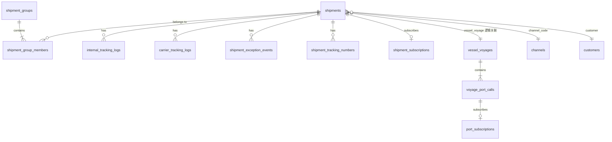

# 数据库结构

## 目录

- [概述](#概述)
- [连接与初始化](#连接与初始化)
- [ER 关系概览](#er-关系概览)
- [核心业务表](#核心业务表)
- [辅助与日志表](#辅助与日志表)
- [码表与配置](#码表与配置)
- [时间格式约定](#时间格式约定)

## 概述

Youzi v2 使用 **SQLite 单文件**数据库，默认路径 `youzi_v2/data/youzi.db`（可通过环境变量覆盖，见 [deployment.md](./deployment.md)）。

表定义在 `db/*_table.py`，启动时由 `db/connection.py` 的 `Database._bootstrap()` 调用各表 `ensure_schema()` 自动建表/迁移。

## 连接与初始化

```python
# db/connection.py
from youzi_v2.db.connection import get_database
db = get_database(db_path)
conn = db.conn  # sqlite3.Connection，row_factory=Row
```

启动顺序：建表 → `seed_if_empty`（码表、字典、地址簿种子数据）。

## ER 关系概览



> 注：除 `voyage_port_calls.voyage_id` 外，多数外键为**逻辑关联**（SQLite 不强制 FK），便于 Excel 分步导入历史数据。

## 核心业务表

### shipments（运单主表）

定义：`db/shipments_table.py`

| 字段 | 类型 | 说明 |
|------|------|------|
| id | TEXT PK | UUID |
| shipment_no | TEXT UNIQUE | 运单号 |
| customer | TEXT | 客户名 |
| customer_no | TEXT | 客户订单号 |
| channel_code | TEXT | 渠道码 |
| country_code | TEXT | 目的国 |
| address_type | TEXT | AMZ / WFS / 3PL |
| address_code | TEXT | 地址编码 |
| delivery_address | TEXT | 派送地址 |
| ctns | INTEGER | 件数 |
| zipcode | TEXT | 邮编 |
| product_name | TEXT | 品名 |
| origin_warehouse_code | TEXT | 起运仓 |
| supplier_name | TEXT | 供应商 |
| carrier_code | TEXT | 承运商 |
| carrier_id | TEXT | 承运商侧 ID |
| tracking_number | TEXT | 主跟踪号 |
| customer_shipment_id | TEXT | 货件号 |
| amazon_ref_id | TEXT | Amazon Ref |
| vessel_name, voyage_no, vessel_voyage | TEXT | 船名 / 航次 / 组合键 |
| etd, eta, atd, ata | TEXT | 海运时间节点 |
| origin_port_code, destination_port_code | TEXT | 起运港 / 目的港 |
| expected_delivery_time | TEXT | 预计送仓时间 |
| warehouse_entry_time | TEXT | 入仓时间（内部轨迹 `Your goods are in the warehouse` 回写） |
| delivered_time | TEXT | 签收时间 |
| status_code | TEXT | 状态码 |
| exception_code | TEXT | 当前异常码 |
| exception_opened_time | TEXT | 异常开启时间 |
| latest_tracking_time, latest_tracking_desc | TEXT | 最新轨迹 |
| tracking_log_count | INTEGER | 轨迹条数 |
| created_time, updated_time | TEXT | 审计字段 |

### vessel_voyages / voyage_port_calls（船期）

定义：`db/vessel_voyages_table.py`

**vessel_voyages**

| 字段 | 说明 |
|------|------|
| id | UUID |
| vessel_voyage | 船名航次（唯一索引，与运单关联键） |
| vessel_name, voyage_no, vessel_code | 船信息 |
| shipping_company | 船公司 |
| notes | 备注 |

**voyage_port_calls**

| 字段 | 说明 |
|------|------|
| voyage_id | FK → vessel_voyages.id |
| port_name | 港口名 |
| sequence | 挂靠序号 |
| eta, ata, etd, atd | 到离港时间 |

### customers（客户）

定义：`db/customers_table.py` — 客户主数据，可从运单同步。

### channels（渠道）

通过 `db/channels_repository.py` 管理，含默认种子 `channel_seeds.py`。主键 `code` 与运单 `channel_code`、DPS `channelCode` 一致；修改 `code` 时会同步更新关联运单。

### shipment_groups / shipment_group_members（运单分组）

定义：`db/shipment_groups_table.py`  
设计说明：[design/shipment-groups-design.md](./design/shipment-groups-design.md)

**shipment_groups** — 业务分组主表（客户批次、船次批次、手动分组等）

| 字段 | 类型 | 说明 |
|------|------|------|
| id | TEXT PK | UUID |
| group_no | TEXT UNIQUE | 分组编号，如 `G260622001` |
| group_name | TEXT | 分组展示名称 |
| primary_type | TEXT | 主分组类型（列表图标/默认展示）；`MANUAL` / `CUSTOMER_BATCH` / … |
| customer | TEXT | 组级客户名 |
| customer_no | TEXT | 组级客户订单号 |
| vessel_voyage | TEXT | 组级船名航次 |
| destination_port_code | TEXT | 目的港 |
| payment_status | TEXT | `UNPAID` / `PARTIAL` / `PAID` |
| payment_due_rule | TEXT | 催款触发规则，首版 `LAST_ARRIVAL` |
| note | TEXT | 备注 |
| created_time, updated_time | TEXT | 审计字段 |

**shipment_group_types** — 分组多类型关系（一批货可同时是到港批次 + 收款批次等）

| 字段 | 类型 | 说明 |
|------|------|------|
| id | TEXT PK | UUID |
| group_id | TEXT | → shipment_groups.id |
| group_type | TEXT | 业务类型枚举值 |
| created_time | TEXT | 创建时间 |

唯一约束：`(group_id, group_type)`。规则启用与 `groupType` 筛选均基于本表**包含**关系，而非仅 `primary_type`。

**shipment_group_members** — 分组成员（关系表；不在 `shipments` 表加 `group_id`）

| 字段 | 类型 | 说明 |
|------|------|------|
| id | TEXT PK | UUID |
| group_id | TEXT | → shipment_groups.id |
| shipment_id | TEXT | → shipments.id |
| shipment_no | TEXT | 运单号冗余 |
| role | TEXT | `NORMAL` / `LAST_BATCH` / `KEY_BATCH` |
| batch_no | TEXT | 批次号 |
| created_time | TEXT | 加入时间 |

唯一约束：`(group_id, shipment_id)`。

**shipment_group_rules** — 组提醒规则（阈值与开关）

| 字段 | 类型 | 说明 |
|------|------|------|
| id | TEXT PK | UUID |
| group_id | TEXT | → shipment_groups.id |
| rule_type | TEXT | `BATCH_DELIVERY_DEADLINE` / `GROUP_ARRIVED_PAYMENT` / `SINGLE_IN_TRANSIT_ETA_WARNING` |
| enabled | INTEGER | 1/0 |
| threshold_days | INTEGER | 签收期限天数（默认 30；单票到港规则不使用） |
| warning_days | INTEGER | 提前预警天数（签收默认 7；单票到港默认 10） |
| trigger_status | TEXT | 预留 |
| config_json | TEXT | 扩展配置 JSON |
| created_time, updated_time | TEXT | 审计字段 |

唯一约束：`(group_id, rule_type)`。新建分组时自动写入默认规则。

**shipment_group_notifications** — 规则扫描产生的提醒事件

| 字段 | 类型 | 说明 |
|------|------|------|
| id | TEXT PK | UUID |
| group_id | TEXT | → shipment_groups.id |
| rule_type | TEXT | 触发的规则类型 |
| severity | TEXT | `info` / `warning` / `urgent` |
| title, message | TEXT | 展示文案 |
| shipment_no | TEXT | 关联运单号（可选） |
| event_key | TEXT UNIQUE | 防重复键 |
| triggered_at | TEXT | 触发时间 |
| read_at, resolved_at | TEXT | 已读 / 已处理 |

定义：`db/shipment_group_alerts_repository.py`；评估逻辑：`services/shipment_group_alerts.py`。

**channel_sla_rules** — 渠道运输时效规则

| 字段 | 类型 | 说明 |
|------|------|------|
| id | TEXT PK | UUID |
| channel_code | TEXT | → channel_codes.code |
| carrier_code | TEXT | 承运商细分，空字符串为渠道默认 |
| start_field | TEXT | 起算字段，首版 `ATD` |
| estimated_days | INTEGER | 预估运输天数 |
| warning_days | INTEGER | 提前提醒天数（默认 3） |
| severe_overdue_days | INTEGER | 严重超时天数（默认 7） |
| enabled | INTEGER | 1/0 |

唯一约束：`(channel_code, carrier_code, start_field)`。配置入口：渠道管理 →「时效」。

**shipment_sla_alerts** — 运输时效预警

| 字段 | 类型 | 说明 |
|------|------|------|
| id | TEXT PK | UUID |
| shipment_id, shipment_no | TEXT | 运单 |
| alert_type | TEXT | `DELIVERY_TIME` / `WAREHOUSE_NO_DEPARTURE` / `ARRIVAL_NO_DELIVERY` |
| risk_level | TEXT | `warning_soon` / `overdue` / `severe_overdue` |
| status | TEXT | `open` / `acknowledged` / `converted` / `resolved` / `ignored` |
| due_date, warning_date | TEXT | 截止日 / 提醒日 |
| event_key | TEXT UNIQUE | 防重复：全程超时 `shipment_id\|DELIVERY_TIME\|rule_id\|due_date`；入库未开船 `shipment_id\|WAREHOUSE_NO_DEPARTURE\|warehouse_entry_date`；到港未送仓 `shipment_id\|ARRIVAL_NO_DELIVERY\|ata_date` |

定义：`db/shipment_sla_alerts_repository.py`；扫描：`services/shipment_sla_scan.py`。

## 辅助与日志表

| 表 | 文件 | 用途 |
|----|------|------|
| internal_tracking_logs | internal_tracking_logs_table.py | 内部/WMS 轨迹 |
| carrier_tracking_logs | carrier_tracking_logs_table.py | 承运商 API 轨迹 |
| shipment_exception_events | shipment_exception_events_table.py | 异常开/关事件 |
| shipment_tracking_numbers | shipment_tracking_numbers_table.py | 多跟踪号 |
| tracking_sync_jobs | tracking_sync_jobs_table.py | 同步任务记录 |
| port_subscriptions | port_subscriptions_table.py | 港口到港订阅 |
| shipment_subscriptions | shipment_subscriptions_table.py | 运单到港订阅 |

## 码表与配置

| 表/模块 | 说明 |
|---------|------|
| code_tables | 通用码表（国家、港口、状态等），见 `db/code_tables.py`；`carrier_codes.carrier_id` 存 DPS carrierId，反查 `carrier_code` |
| dict | 字典项，`db/dict_table.py` |
| app_settings | 应用设置键值 |
| quote_history | 报价历史 |
| addresses | 派送地址簿 |
| addresses_warehouse | 仓库地址簿 |

## 时间格式约定

所有时间列统一 **TEXT**，格式 `YYYY-MM-DD HH:mm:ss`（见各 `*_table.py` 文件头注释）。Repository 层通过 `db/datetime_util.py` 读写。

## 相关文档

- [shipment-flow.md](./shipment-flow.md) — 运单业务流
- [modules/shipment/README.md](./modules/shipment/README.md) — 运单模块
- [db/README.md](../db/README.md) — 数据层代码说明
