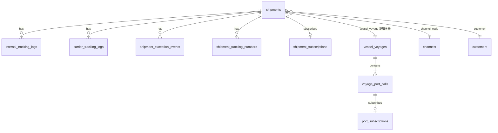

# 数据库结构

## 目录

- [概述](#概述)
- [连接与初始化](#连接与初始化)
- [ER 关系概览](#er-关系概览)
- [核心业务表](#核心业务表)
- [辅助与日志表](#辅助与日志表)
- [码表与配置](#码表与配置)
- [时间格式约定](#时间格式约定)

## 概述

Youzi v2 使用 **SQLite 单文件**数据库，默认路径 `youzi_v2/data/youzi.db`（可通过环境变量覆盖，见 [deployment.md](./deployment.md)）。

表定义在 `db/*_table.py`，启动时由 `db/connection.py` 的 `Database._bootstrap()` 调用各表 `ensure_schema()` 自动建表/迁移。

## 连接与初始化

```python
# db/connection.py
from youzi_v2.db.connection import get_database
db = get_database(db_path)
conn = db.conn  # sqlite3.Connection，row_factory=Row
```

启动顺序：建表 → `seed_if_empty`（码表、字典、地址簿种子数据）。

## ER 关系概览



> 注：除 `voyage_port_calls.voyage_id` 外，多数外键为**逻辑关联**（SQLite 不强制 FK），便于 Excel 分步导入历史数据。

## 核心业务表

### shipments（运单主表）

定义：`db/shipments_table.py`

| 字段 | 类型 | 说明 |
|------|------|------|
| id | TEXT PK | UUID |
| shipment_no | TEXT UNIQUE | 运单号 |
| customer | TEXT | 客户名 |
| customer_no | TEXT | 客户订单号 |
| channel_code | TEXT | 渠道码 |
| country_code | TEXT | 目的国 |
| address_type | TEXT | AMZ / WFS / 3PL |
| address_code | TEXT | 地址编码 |
| delivery_address | TEXT | 派送地址 |
| ctns | INTEGER | 件数 |
| zipcode | TEXT | 邮编 |
| product_name | TEXT | 品名 |
| origin_warehouse_code | TEXT | 起运仓 |
| supplier_name | TEXT | 供应商 |
| carrier_code | TEXT | 承运商 |
| carrier_id | TEXT | 承运商侧 ID |
| tracking_number | TEXT | 主跟踪号 |
| customer_shipment_id | TEXT | 货件号 |
| amazon_ref_id | TEXT | Amazon Ref |
| vessel_name, voyage_no, vessel_voyage | TEXT | 船名 / 航次 / 组合键 |
| etd, eta, atd, ata | TEXT | 海运时间节点 |
| origin_port_code, destination_port_code | TEXT | 起运港 / 目的港 |
| delivered_time | TEXT | 签收时间 |
| status_code | TEXT | 状态码 |
| exception_code | TEXT | 当前异常码 |
| exception_opened_time | TEXT | 异常开启时间 |
| latest_tracking_time, latest_tracking_desc | TEXT | 最新轨迹 |
| tracking_log_count | INTEGER | 轨迹条数 |
| created_time, updated_time | TEXT | 审计字段 |

### vessel_voyages / voyage_port_calls（船期）

定义：`db/vessel_voyages_table.py`

**vessel_voyages**

| 字段 | 说明 |
|------|------|
| id | UUID |
| vessel_voyage | 船名航次（唯一索引，与运单关联键） |
| vessel_name, voyage_no, vessel_code | 船信息 |
| shipping_company | 船公司 |
| notes | 备注 |

**voyage_port_calls**

| 字段 | 说明 |
|------|------|
| voyage_id | FK → vessel_voyages.id |
| port_name | 港口名 |
| sequence | 挂靠序号 |
| eta, ata, etd, atd | 到离港时间 |

### customers（客户）

定义：`db/customers_table.py` — 客户主数据，可从运单同步。

### channels（渠道）

通过 `db/channels_repository.py` 管理，含默认种子 `channel_seeds.py`。

## 辅助与日志表

| 表 | 文件 | 用途 |
|----|------|------|
| internal_tracking_logs | internal_tracking_logs_table.py | 内部/WMS 轨迹 |
| carrier_tracking_logs | carrier_tracking_logs_table.py | 承运商 API 轨迹 |
| shipment_exception_events | shipment_exception_events_table.py | 异常开/关事件 |
| shipment_tracking_numbers | shipment_tracking_numbers_table.py | 多跟踪号 |
| tracking_sync_jobs | tracking_sync_jobs_table.py | 同步任务记录 |
| port_subscriptions | port_subscriptions_table.py | 港口到港订阅 |
| shipment_subscriptions | shipment_subscriptions_table.py | 运单到港订阅 |

## 码表与配置

| 表/模块 | 说明 |
|---------|------|
| code_tables | 通用码表（国家、港口、状态等），见 `db/code_tables.py` |
| dict | 字典项，`db/dict_table.py` |
| app_settings | 应用设置键值 |
| quote_history | 报价历史 |
| addresses | 派送地址簿 |
| addresses_warehouse | 仓库地址簿 |

## 时间格式约定

所有时间列统一 **TEXT**，格式 `YYYY-MM-DD HH:mm:ss`（见各 `*_table.py` 文件头注释）。Repository 层通过 `db/datetime_util.py` 读写。

## 相关文档

- [shipment-flow.md](./shipment-flow.md) — 运单业务流
- [modules/shipment/README.md](./modules/shipment/README.md) — 运单模块
- [db/README.md](../db/README.md) — 数据层代码说明
